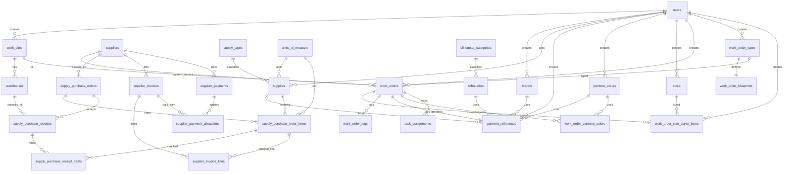

# Estructura de base de datos

Documento **evolutivo**: describe tablas, campos clave y relaciones **orientativas** para alinear negocio e ingeniería. No sustituye el diagrama ER definitivo ni las migraciones del código hasta cerrar el listado de entidades (preguntas **19–20** en `Pregutas de la AI.md`).

---

## Cómo está estructurado este archivo (convención)

Cada **entidad** se documenta así:

1. **Nombre lógico** (español) y **nombre físico sugerido** en inglés (`snake_case`), alineado al acuerdo de **código en inglés**.
2. **Propósito** en una línea.
3. **Tabla de columnas:** nombre de columna | tipo indicativo | obligatorio | notas.
4. **Relaciones:** qué otras entidades referencia (`FK`) o qué la referencia.

**Convenciones generales (sugeridas):**

| Convención | Detalle |
|------------|---------|
| Clave primaria | `id` tipo `UUID` o `BIGSERIAL` (elegir en diseño técnico). |
| **Creador (todas las tablas)** | `created_by_user_id` → `users.id` (**obligatorio** en altas de negocio). El **nombre** del usuario se obtiene por `JOIN` a `users.full_name` (no duplicar en cada tabla salvo requerimiento legal de snapshot). Ver **excepciones** abajo. |
| Auditoría mínima | `created_at`, `updated_at` (`TIMESTAMPTZ`); opcional `updated_by_user_id` → `users`. |
| Borrado | Preferir **soft delete** `deleted_at` en tablas maestras si el negocio lo requiere. |
| Multi-sitio | Tablas operativas llevan `work_site_id` y/o `warehouse_id` cuando aplique. |
| Unidades | Cantidades numéricas + `unit_of_measure_id` o campo contextual según acuerdo (pregunta 22). |

**Excepciones a `created_by_user_id`:**

| Tabla | Criterio |
|-------|----------|
| `users` | `created_by_user_id` **nullable** (primer usuario del sistema o carga inicial); o FK al propio `id` si se permite autoregistro. |
| `audit_logs` | El actor del evento es `user_id`; opcionalmente `created_by_user_id` = mismo `user_id` por uniformidad de informes, o se omite la columna y solo se usa `user_id`. |

Los **tipos** son orientativos (PostgreSQL como referencia común en servidores internos).

> **Nota:** El nombre físico de **Referencia** no debe ser `references` (palabra reservada en SQL). Aquí se usa **`garment_references`** (referencia de prenda / estilo).

---

## Catálogos y maestros (marca, silueta, talla, color Pantone, proveedor, insumo, compras de insumo)

### A. Marca

**Lógico:** Marca · **Físico:** `brands`

| Columna | Tipo | Obl. | Notas |
|---------|------|------|--------|
| `id` | UUID | Sí | PK |
| `name` | VARCHAR(255) | Sí | Nombre de marca |
| `abbreviation` | VARCHAR(32) | Sí | Abreviatura (única) |
| `consecutivo` | INT | Sí | **UNIQUE**; 3 dígitos (100–999); primeros 3 caracteres del `code` de referencia |
| `logo_url` | TEXT | No | URL o clave de almacenamiento del logo |
| `next_reference_sequence` | BIGINT | Sí | Legacy; la secuencia por marca se calcula con `MAX(reference_sequence)` en `garment_references` |
| `created_at` | TIMESTAMPTZ | Sí | |
| `updated_at` | TIMESTAMPTZ | Sí | |
| `created_by_user_id` | UUID | Sí | FK → `users` |

**Relaciones:** Referenciada por `garment_references`.

---

### B. Categoría de silueta (lista seleccionable)

**Lógico:** Categoría de silueta · **Físico:** `silhouette_categories`

| Columna | Tipo | Obl. | Notas |
|---------|------|------|--------|
| `id` | UUID | Sí | PK |
| `name` | VARCHAR(128) | Sí | Valor mostrado en lista (único) |
| `sort_order` | INT | No | Orden en UI |
| `is_active` | BOOLEAN | Sí | |
| `created_at` | TIMESTAMPTZ | Sí | |
| `updated_at` | TIMESTAMPTZ | Sí | |
| `created_by_user_id` | UUID | Sí | FK → `users` |

**Relaciones:** `silhouettes.silhouette_category_id` → aquí.

---

### C. Silueta

**Lógico:** Silueta · **Físico:** `silhouettes`

| Columna | Tipo | Obl. | Notas |
|---------|------|------|--------|
| `id` | UUID | Sí | PK |
| `name` | VARCHAR(255) | Sí | Nombre |
| `silhouette_category_id` | UUID | Sí | FK → `silhouette_categories` (lista seleccionable) |
| `gender` | VARCHAR(32) | No | Ej. `female`, `male`, `unisex` o catálogo acordado |
| `description` | TEXT | No | |
| `image_url` | TEXT | No | Imagen |
| `created_at` | TIMESTAMPTZ | Sí | |
| `updated_at` | TIMESTAMPTZ | Sí | |
| `created_by_user_id` | UUID | Sí | FK → `users` |

**Relaciones:** `silhouette_categories`; referenciada por `garment_references`.

---

### D. Proveedor

**Lógico:** Proveedor (empresa) · **Físico:** `suppliers`

| Columna | Tipo | Obl. | Notas |
|---------|------|------|--------|
| `id` | UUID | Sí | PK |
| `legal_name` | VARCHAR(255) | Sí | Razón social |
| `trade_name` | VARCHAR(255) | No | Nombre comercial |
| `tax_id` | VARCHAR(64) | No | NIT / identificación fiscal |
| `country` | VARCHAR(64) | No | |
| `city` | VARCHAR(128) | No | |
| `address` | TEXT | No | |
| `phone` | VARCHAR(64) | No | |
| `email` | VARCHAR(255) | No | |
| `website` | VARCHAR(255) | No | |
| `contact_person` | VARCHAR(255) | No | |
| `notes` | TEXT | No | |
| `is_active` | BOOLEAN | Sí | |
| `created_at` | TIMESTAMPTZ | Sí | |
| `updated_at` | TIMESTAMPTZ | Sí | |
| `created_by_user_id` | UUID | Sí | FK → `users` |

**Relaciones:** **`supply_purchase_orders`** (órdenes de compra de insumos), **`supplier_invoices`**, **`supplier_payments`**; proveedor habitual en `supplies.default_supplier_id`; **patronaje** en **`production_orders.pattern_supplier_id`**.

---

### E. Tipo de insumo (catálogo)

**Lógico:** Tipo de insumo · **Físico:** `supply_types`

| Columna | Tipo | Obl. | Notas |
|---------|------|------|--------|
| `id` | UUID | Sí | PK |
| `code` | VARCHAR(32) | Sí | Único: `fabric`, `thread`, `button`, `tack`, `zipper`, … |
| `name` | VARCHAR(128) | Sí | Etiqueta UI: Tela, hilo, botón, tache, cierre, etc. |
| `sort_order` | INT | No | |
| `created_at` | TIMESTAMPTZ | Sí | |
| `updated_at` | TIMESTAMPTZ | Sí | |
| `created_by_user_id` | UUID | Sí | FK → `users` |

**Datos semilla sugeridos:** Tela, hilo, botón, tache, cierre (ampliar según negocio).

---

### F. Insumo

**Lógico:** Insumo · **Físico:** `supplies`

| Columna | Tipo | Obl. | Notas |
|---------|------|------|--------|
| `id` | UUID | Sí | PK |
| `name` | VARCHAR(255) | Sí | Nombre del insumo |
| `supply_type_id` | UUID | Sí | FK → `supply_types` (categoría: Tela, hilo, etc.) |
| `seller_user_id` | UUID | Sí | FK → `users` (**vendedor** asociado; perfil vendedor del acta) |
| `default_supplier_id` | UUID | No | FK → `suppliers` (opcional) |
| `unit_of_measure_id` | UUID | Sí | FK → **`units_of_measure`** (unidad de medida del insumo para compras e inventario) |
| `stock_on_hand` | NUMERIC(18,4) | Sí | **Stock** disponible a nivel del insumo (ver nota multi-almacén abajo) |
| `stock_on_way` | NUMERIC(18,4) | Sí | **Stock en tránsito**: cantidad en órdenes de compra **aún no recibida** (actualizar al confirmar recepciones o calcular por vista) |
| `purchase_unit_price` | NUMERIC(18,4) | No | **Precio de compra** de referencia del insumo (último precio pactado, estándar o promedio; el precio por línea de OC queda en `supply_purchase_order_items`) |
| `sku` | VARCHAR(64) | No | Código interno |
| `description` | TEXT | No | |
| `is_active` | BOOLEAN | Sí | |
| `created_at` | TIMESTAMPTZ | Sí | |
| `updated_at` | TIMESTAMPTZ | Sí | |
| `created_by_user_id` | UUID | Sí | FK → `users` |

**Nota — stock por almacén vs totales en `supplies`:** Si el inventario detallado vive en **`inventory_stock_lots`** por `warehouse_id`, `stock_on_hand` y `stock_on_way` pueden ser **totales corporativos** mantenidos por job/trigger o **materializados** para pantallas de compras. Si el negocio prefiere solo almacenes, estos campos pueden sustituirse por **vistas** agregadas y no almacenarse en `supplies`.

**Regla de negocio:** En **`garment_references`**, el campo **tela** debe apuntar a un `supplies.id` cuyo `supply_types.code` = `fabric` (Tela). Validar en aplicación o con constraint compuesto si se materializa tipo en misma fila.

**Relaciones:** `supply_types`, `users` (vendedor), `suppliers` (opcional), **`units_of_measure`**, líneas de **`supply_purchase_order_items`**.

---

### G. Color (Pantone)

**Lógico:** Color · **Físico:** `pantone_colors`

Catálogo de colores **alineado al estándar Pantone**. Cada fila representa un color identificable de forma inequívoca según la nomenclatura Pantone (sistema + código). Los valores **L\*a\*b\***, **RGB** o **hex** son **orientativos** para pantalla o impresión aproximada; la **fuente de verdad** del color en negocio es el **código Pantone** oficial.

| Columna | Tipo | Obl. | Notas |
|---------|------|------|--------|
| `id` | UUID | Sí | PK |
| `pantone_system` | VARCHAR(16) | Sí | Sistema Pantone usado por la empresa, ej. `TCX`, `TPG`, `TPX` (textil / gráfico / plásticos, etc.) |
| `pantone_code` | VARCHAR(32) | Sí | Código numérico o alfanumérico Pantone, ej. `19-4052` (único junto con `pantone_system`) |
| `pantone_label` | VARCHAR(128) | No | Denominación comercial Pantone si se desea almacenar (ej. nombre de la temporada) |
| `name` | VARCHAR(255) | No | Nombre interno o alias en español para la UI |
| `hex_approx` | CHAR(7) | No | Aproximación `#RRGGBB` solo para vista previa (no sustituye al Pantone) |
| `rgb_r` | SMALLINT | No | 0–255, opcional |
| `rgb_g` | SMALLINT | No | |
| `rgb_b` | SMALLINT | No | |
| `lab_l` | NUMERIC(6,3) | No | CIE L\*a\*b\* opcional si se dispone de medición |
| `lab_a` | NUMERIC(6,3) | No | |
| `lab_b` | NUMERIC(6,3) | No | |
| `notes` | TEXT | No | Observaciones (lote de tinta, proveedor de color, etc.) |
| `is_active` | BOOLEAN | Sí | Default `true` |
| `created_at` | TIMESTAMPTZ | Sí | |
| `updated_at` | TIMESTAMPTZ | Sí | |
| `created_by_user_id` | UUID | Sí | FK → `users` |

**Restricción de unicidad recomendada:** `UNIQUE (pantone_system, pantone_code)`.

**Relaciones:** Catálogo referenciado por `garment_references.pantone_color_id` (color a nivel **referencia** / OP) y por **`work_order_pantone_colors`** (asociación a **órdenes de trabajo**; ver núcleo operativo).

---

### H. Talla

**Lógico:** Talla · **Físico:** `sizes`

Catálogo maestro de tallas usado en la **curva de tallas** de cada orden de producción.

| Columna | Tipo | Obl. | Notas |
|---------|------|------|--------|
| `id` | UUID | Sí | PK |
| `name` | VARCHAR(64) | Sí | **Nombre de la talla; único** (`UNIQUE`). Ej.: `XS`, `S`, `M`, `L`, `28`, `Talla única`, etc. |
| `sort_order` | INT | No | Orden de presentación en curvas e informes |
| `is_active` | BOOLEAN | Sí | Default `true` |
| `created_at` | TIMESTAMPTZ | Sí | |
| `updated_at` | TIMESTAMPTZ | Sí | |
| `created_by_user_id` | UUID | Sí | FK → `users` |

**Restricción:** `UNIQUE (name)` (case sensitivity según collation del motor; recomendado normalizar mayúsculas/minúsculas en aplicación si aplica).

**Relaciones:** Referenciada por **`work_order_size_curve_items`**.

---

### I. Referencia de prenda

> Documentación en **§5** (catálogo manual u OT operativa vía `work_order_id`).

---

## Compras de insumos (secuencia operativa)

Flujo documentado: **Orden de compra de insumos** → **Recibidos** (parciales o totales) → **Factura de proveedor** → **Pagos a proveedor**. Las fechas y estados exactos se definen en reglas de negocio.

**Orden de migración sugerido:** crear **`units_of_measure`** (§7 del núcleo operativo) **antes** que **`supplies`**, ya que `supplies.unit_of_measure_id` la referencia.

### J. Orden de compra de insumos (cabecera)

**Lógico:** Orden de compra de insumos · **Físico:** `supply_purchase_orders`

| Columna | Tipo | Obl. | Notas |
|---------|------|------|--------|
| `id` | UUID | Sí | PK |
| `code` | VARCHAR(64) | Sí | Número visible único de la OC |
| `supplier_id` | UUID | Sí | FK → `suppliers` |
| `status` | VARCHAR(32) | Sí | Ej. `draft`, `sent`, `partially_received`, `closed`, `cancelled` |
| `ordered_at` | TIMESTAMPTZ | No | Fecha de emisión / envío al proveedor |
| `expected_at` | DATE | No | Fecha esperada de entrega |
| `default_warehouse_id` | UUID | No | FK → `warehouses` (recepción por defecto) |
| `notes` | TEXT | No | |
| `created_at` | TIMESTAMPTZ | Sí | |
| `updated_at` | TIMESTAMPTZ | Sí | |
| `created_by_user_id` | UUID | Sí | FK → `users` |

**Relaciones:** `suppliers`, `warehouses`; detalle en **`supply_purchase_order_items`**; recepciones en **`supply_purchase_receipts`**; facturas vía **`supplier_invoice_lines`** (enlace opcional a ítem de OC).

---

### K. Ítems de orden de compra de insumos

**Lógico:** Línea de OC de insumos · **Físico:** `supply_purchase_order_items`

| Columna | Tipo | Obl. | Notas |
|---------|------|------|--------|
| `id` | UUID | Sí | PK |
| `supply_purchase_order_id` | UUID | Sí | FK → `supply_purchase_orders` |
| `supply_id` | UUID | Sí | FK → `supplies` |
| `quantity_ordered` | NUMERIC(18,4) | Sí | Cantidad pedida |
| `quantity_received` | NUMERIC(18,4) | Sí | Default `0`; suma de recepciones (mantener por trigger/app o calcular desde `supply_purchase_receipt_items`) |
| `unit_of_measure_id` | UUID | Sí | FK → `units_of_measure` (puede coincidir con la del insumo) |
| `unit_price` | NUMERIC(18,4) | No | Precio unitario negociado en la línea |
| `line_total` | NUMERIC(18,4) | No | Opcional denormalizado |
| `created_at` | TIMESTAMPTZ | Sí | |
| `updated_at` | TIMESTAMPTZ | Sí | |
| `created_by_user_id` | UUID | Sí | FK → `users` |

**Restricción sugerida:** `UNIQUE (supply_purchase_order_id, supply_id)` si no se permiten líneas duplicadas del mismo insumo en la misma OC.

---

### L. Recibido de orden de compra de insumos (cabecera)

**Lógico:** Recibido de mercancía contra OC · **Físico:** `supply_purchase_receipts`

| Columna | Tipo | Obl. | Notas |
|---------|------|------|--------|
| `id` | UUID | Sí | PK |
| `supply_purchase_order_id` | UUID | Sí | FK → `supply_purchase_orders` |
| `warehouse_id` | UUID | Sí | FK → `warehouses` (donde ingresa la mercancía) |
| `received_at` | TIMESTAMPTZ | Sí | Fecha/hora del recibo |
| `status` | VARCHAR(32) | Sí | Ej. `posted`, `cancelled` |
| `notes` | TEXT | No | |
| `created_at` | TIMESTAMPTZ | Sí | |
| `updated_at` | TIMESTAMPTZ | Sí | |
| `created_by_user_id` | UUID | Sí | FK → `users` |

**Relaciones:** Líneas en **`supply_purchase_receipt_items`**. Al **postear** un recibo, actualizar **`quantity_received`** en la línea de OC, **`stock_on_hand`** / **`stock_on_way`** en `supplies` y movimientos en **`inventory_movements`** según diseño.

---

### M. Ítems del recibo de OC

**Lógico:** Línea de recibo · **Físico:** `supply_purchase_receipt_items`

| Columna | Tipo | Obl. | Notas |
|---------|------|------|--------|
| `id` | UUID | Sí | PK |
| `supply_purchase_receipt_id` | UUID | Sí | FK → `supply_purchase_receipts` |
| `supply_purchase_order_item_id` | UUID | Sí | FK → `supply_purchase_order_items` |
| `quantity_received` | NUMERIC(18,4) | Sí | Cantidad aceptada en este recibo |
| `created_at` | TIMESTAMPTZ | Sí | |
| `created_by_user_id` | UUID | Sí | FK → `users` |

---

### N. Factura de proveedor

**Lógico:** Factura de proveedor · **Físico:** `supplier_invoices`

| Columna | Tipo | Obl. | Notas |
|---------|------|------|--------|
| `id` | UUID | Sí | PK |
| `supplier_id` | UUID | Sí | FK → `suppliers` |
| `invoice_number` | VARCHAR(64) | Sí | Número de factura del proveedor |
| `invoice_date` | DATE | Sí | |
| `due_date` | DATE | No | Vencimiento de pago |
| `currency` | CHAR(3) | Sí | Ej. `COP`, `USD` |
| `subtotal` | NUMERIC(18,4) | Sí | |
| `tax_amount` | NUMERIC(18,4) | No | |
| `total` | NUMERIC(18,4) | Sí | |
| `status` | VARCHAR(32) | Sí | Ej. `draft`, `registered`, `partially_paid`, `paid`, `cancelled` |
| `notes` | TEXT | No | |
| `created_at` | TIMESTAMPTZ | Sí | |
| `updated_at` | TIMESTAMPTZ | Sí | |
| `created_by_user_id` | UUID | Sí | FK → `users` |

**Restricción sugerida:** `UNIQUE (supplier_id, invoice_number)`.

**Relaciones:** Líneas opcionales **`supplier_invoice_lines`**; imputación a OC vía **`supplier_invoice_lines.supply_purchase_order_item_id`** (nullable) o tabla puente si una factura agrupa varias OC.

---

### O. Líneas de factura de proveedor (opcional pero recomendada)

**Lógico:** Detalle de factura · **Físico:** `supplier_invoice_lines`

| Columna | Tipo | Obl. | Notas |
|---------|------|------|--------|
| `id` | UUID | Sí | PK |
| `supplier_invoice_id` | UUID | Sí | FK → `supplier_invoices` |
| `supply_purchase_order_item_id` | UUID | No | FK → `supply_purchase_order_items` (vincular factura con línea de OC) |
| `description` | VARCHAR(255) | No | |
| `quantity` | NUMERIC(18,4) | No | |
| `unit_price` | NUMERIC(18,4) | No | |
| `line_total` | NUMERIC(18,4) | Sí | |
| `created_at` | TIMESTAMPTZ | Sí | |
| `created_by_user_id` | UUID | Sí | FK → `users` |

---

### P. Pago a proveedor

**Lógico:** Pago a proveedor · **Físico:** `supplier_payments`

| Columna | Tipo | Obl. | Notas |
|---------|------|------|--------|
| `id` | UUID | Sí | PK |
| `supplier_id` | UUID | Sí | FK → `suppliers` |
| `paid_at` | TIMESTAMPTZ | Sí | Fecha efectiva del pago |
| `amount` | NUMERIC(18,4) | Sí | Monto pagado |
| `currency` | CHAR(3) | Sí | |
| `payment_method` | VARCHAR(32) | No | Transferencia, cheque, etc. |
| `reference` | VARCHAR(128) | No | Número de comprobante bancario |
| `notes` | TEXT | No | |
| `created_at` | TIMESTAMPTZ | Sí | |
| `updated_at` | TIMESTAMPTZ | Sí | |
| `created_by_user_id` | UUID | Sí | FK → `users` |

**Relaciones:** Imputación a facturas en **`supplier_payment_allocations`** (un pago puede cubrir varias facturas).

---

### Q. Imputación de pago a factura

**Lógico:** Aplicación de pago a factura · **Físico:** `supplier_payment_allocations`

| Columna | Tipo | Obl. | Notas |
|---------|------|------|--------|
| `id` | UUID | Sí | PK |
| `supplier_payment_id` | UUID | Sí | FK → `supplier_payments` |
| `supplier_invoice_id` | UUID | Sí | FK → `supplier_invoices` |
| `amount` | NUMERIC(18,4) | Sí | Monto de este pago aplicado a esta factura |
| `created_at` | TIMESTAMPTZ | Sí | |
| `created_by_user_id` | UUID | Sí | FK → `users` |

---

## Ejemplo de entidades (núcleo operativo — borrador)

### 1. Planta de trabajo

**Lógico:** Planta de trabajo · **Físico:** `work_sites`

| Columna | Tipo | Obl. | Notas |
|---------|------|------|--------|
| `id` | UUID | Sí | PK |
| `code` | VARCHAR(32) | Sí | Código corto único |
| `name` | VARCHAR(255) | Sí | Nombre visible |
| `is_active` | BOOLEAN | Sí | Default `true` |
| `created_at` | TIMESTAMPTZ | Sí | |
| `updated_at` | TIMESTAMPTZ | Sí | |
| `created_by_user_id` | UUID | Sí | FK → `users` |

**Relaciones:** Referenciada por `warehouses`, `production_orders`, etc.

---

### 2. Almacén

**Lógico:** Almacén · **Físico:** `warehouses`

| Columna | Tipo | Obl. | Notas |
|---------|------|------|--------|
| `id` | UUID | Sí | PK |
| `work_site_id` | UUID | No | FK → `work_sites` |
| `code` | VARCHAR(32) | Sí | Único global o por planta (regla S4) |
| `name` | VARCHAR(255) | Sí | |
| `is_active` | BOOLEAN | Sí | |
| `created_at` | TIMESTAMPTZ | Sí | |
| `updated_at` | TIMESTAMPTZ | Sí | |
| `created_by_user_id` | UUID | Sí | FK → `users` |

---

### 3. Usuario (autenticación)

**Lógico:** Usuario del sistema · **Físico:** `users`

| Columna | Tipo | Obl. | Notas |
|---------|------|------|--------|
| `id` | UUID | Sí | PK |
| `email` | VARCHAR(255) | Sí | Único |
| `password_hash` | TEXT | Sí | O SSO más adelante |
| `full_name` | VARCHAR(255) | Sí | Nombre para mostrar y joins de creador |
| `is_active` | BOOLEAN | Sí | |
| `created_at` | TIMESTAMPTZ | Sí | |
| `updated_at` | TIMESTAMPTZ | Sí | |
| `created_by_user_id` | UUID | No | Nullable: bootstrap / primer administrador |

---

### 4. Rol y asignación (perfiles personalizables)

**Lógico:** Rol configurable · **Físico:** `roles`

| Columna | Tipo | Obl. | Notas |
|---------|------|------|--------|
| `id` | UUID | Sí | PK |
| `key` | VARCHAR(64) | Sí | Ej. `area_manager`, `workshop` |
| `name` | VARCHAR(128) | Sí | Etiqueta en español en UI |
| `created_at` | TIMESTAMPTZ | Sí | |
| `updated_at` | TIMESTAMPTZ | Sí | |
| `created_by_user_id` | UUID | Sí | FK → `users` |

**Lógico:** Usuario tiene rol en contexto · **Físico:** `user_roles`

| Columna | Tipo | Obl. | Notas |
|---------|------|------|--------|
| `id` | UUID | Sí | PK surrogate (recomendado) |
| `user_id` | UUID | Sí | FK → `users` |
| `role_id` | UUID | Sí | FK → `roles` |
| `work_site_id` | UUID | No | Alcance por planta |
| `created_at` | TIMESTAMPTZ | Sí | |
| `created_by_user_id` | UUID | Sí | FK → `users` |

---

### 5. Referencia de prenda (catálogo manual u OT operativa)

**Lógico:** Referencia de prenda · **Físico:** `garment_references`

- **Catálogo** (`work_order_id` nulo): alta manual en UI; crear, editar y desactivar (`is_active`).
- **OT** (`work_order_id` UNIQUE): referencia operativa **1:1** con `work_orders`; mismo esquema de código y serie.

**ID visible (`code`, 9 caracteres):** `brands.consecutivo` (3) + `reference_sequence` por marca (3, 100–999, siguiente al máximo existente) + `serie` (3).

**Serie:** asignada al elegir `reference_type`: `muestra` → `M00`–`M99`; `produccion` → `P00`–`P99`.

| Columna | Tipo | Obl. | Notas |
|---------|------|------|--------|
| `id` | UUID | Sí | PK |
| `work_order_id` | UUID | No | FK **UNIQUE** → `work_orders` (referencia de OT) |
| `code` | VARCHAR(9) | Sí | **UNIQUE**; ID de negocio (ver regla arriba) |
| `reference_type` | VARCHAR(32) | Sí | `muestra` \| `produccion` |
| `serie` | VARCHAR(3) | Sí | Auto según tipo |
| `reference_sequence` | INT | Sí | Secuencia numérica por marca (100–999) |
| `title` | VARCHAR(255) | No | Nombre / descripción |
| `status` | VARCHAR(32) | Sí | Default `active` en catálogo |
| `is_active` | BOOLEAN | Sí | Default `true`; desactivar sin borrar |
| `image_url` | TEXT | No | Imagen principal |
| `brand_id` | UUID | Sí | FK → `brands` |
| `silhouette_id` | UUID | No | FK → `silhouettes` |
| `fabric_supply_id` | UUID | No | FK → `supplies` (**insumo tipo Tela**) |
| `pantone_color_id` | UUID | No | FK → `pantone_colors` (color principal) |
| `garment_image_url_1` | TEXT | No | Imagen 1 (prenda operativa) |
| `garment_image_url_2` | TEXT | No | Imagen 2 |
| `garment_image_url_3` | TEXT | No | Imagen 3 |
| `cut_garments_qty` | INT | No | Prendas cortadas |
| `programmed_garments_qty` | INT | No | Prendas programadas |
| `created_at` | TIMESTAMPTZ | Sí | |
| `updated_at` | TIMESTAMPTZ | Sí | |
| `created_by_user_id` | UUID | Sí | FK → `users` |

**Relaciones:** `work_orders` (1:1 vía `work_order_id` UNIQUE), `brands`, `silhouettes`, `supplies` (tela), `pantone_colors`.

**Nota:** el catálogo no se vincula automáticamente a OT; al crear OT con referencia se genera un nuevo `code` con marca y tipo indicados.

---

### 6a. Tipo de orden de trabajo

**Lógico:** Tipo de orden de trabajo · **Físico:** `work_order_types`

Catálogo que define la **plantilla de flujo** (blueprint) aplicable a las OT de ese tipo (p. ej. Corte, Confección, Terminación). Relación **1:1** con `work_order_blueprints`.

| Columna | Tipo | Obl. | Notas |
|---------|------|------|--------|
| `id` | UUID | Sí | PK |
| `code` | VARCHAR(32) | Sí | Código único (`CORTE`, `PCC`, …) |
| `name` | VARCHAR(255) | Sí | Nombre visible |
| `description` | TEXT | No | |
| `is_active` | BOOLEAN | Sí | Default `true` |
| `created_at` | TIMESTAMPTZ | Sí | |
| `updated_at` | TIMESTAMPTZ | Sí | |
| `created_by_user_id` | UUID | Sí | FK → `users` |

**Relaciones:** **`work_order_blueprints`** (uno por tipo); **`work_orders`** que referencian el tipo.

**UI:** Configuración → Tipos de OT (`/settings/work-order-types`); enlace a editor de blueprint.

---

### 6a2. Blueprint de flujo (por tipo de OT)

**Lógico:** Blueprint de orden de trabajo · **Físico:** `work_order_blueprints`

Grafo de **estados** (nodos = tareas/fases) y **transiciones** (aristas con acciones declarativas). Se edita en canvas (React Flow); al **publicar** queda disponible para nuevas OT del tipo.

| Columna | Tipo | Obl. | Notas |
|---------|------|------|--------|
| `id` | UUID | Sí | PK |
| `work_order_type_id` | UUID | Sí | FK **única** → `work_order_types` |
| `version` | INT | Sí | Incrementa en cada publicación |
| `status` | VARCHAR(16) | Sí | `draft` \| `published` |
| `definition_json` | JSONB | Sí | Grafo: `nodes`, `edges`, `initialStateKey` (ver `docs/007-work-order-blueprints.md`) |
| `published_at` | TIMESTAMPTZ | No | |
| `created_at` | TIMESTAMPTZ | Sí | |
| `updated_at` | TIMESTAMPTZ | Sí | |
| `created_by_user_id` | UUID | Sí | FK → `users` |

**Runtime:** al crear una OT con tipo y blueprint publicado, se copia `definition_json` a `work_orders.blueprint_snapshot_json` y se fija `current_state_key` al estado inicial.

---

### 6b. Orden de trabajo (entidad principal de producción)

**Lógico:** Orden de trabajo · **Físico:** `work_orders`

Unidad principal de producción en planta (antes "orden de producción" + "orden de trabajo" separadas). Incluye campos de planificación (tipo producción, patronaje, diseño) y de ejecución (blueprint, estado, cierre).

| Columna | Tipo | Obl. | Notas |
|---------|------|------|--------|
| `id` | UUID | Sí | PK |
| `work_order_type_id` | UUID | No | FK → `work_order_types` |
| `work_site_id` | UUID | Sí | FK → `work_sites` (planta) |
| `code` | VARCHAR(64) | Sí | Código visible **único** |
| `title` | VARCHAR(255) | No | Descripción corta |
| `status` | VARCHAR(32) | Sí | `pending`, `in_progress`, `completed`, `cancelled` |
| `production_type` | VARCHAR(32) | No | `development` \| `batch_production` |
| `pattern_supplier_id` | UUID | No | FK → `suppliers` (proveedor de patronaje) |
| `patterning_days` | INT | No | Días en patronaje |
| `design_instructions` | TEXT | No | Instrucciones de diseño |
| `design_instructions_updated_at` | TIMESTAMPTZ | No | Última modificación instrucciones |
| `design_attachments_json` | JSONB | No | Anexos de diseño |
| `closed_at` | TIMESTAMPTZ | No | Fecha de cierre |
| `closed_by_user_id` | UUID | No | FK → `users` (quien cierra) |
| `current_state_key` | VARCHAR(128) | No | Nodo actual en el grafo del blueprint |
| `blueprint_version` | INT | No | Versión del blueprint al instanciar |
| `blueprint_snapshot_json` | JSONB | No | Copia congelada de `definition_json` |
| `created_at` | TIMESTAMPTZ | Sí | |
| `updated_at` | TIMESTAMPTZ | Sí | |
| `created_by_user_id` | UUID | Sí | FK → `users` |

**Relaciones:** `work_order_types`, `work_sites`, `suppliers` (patronaje); **`garment_references`** (1:1 vía `work_order_id`); **`work_order_size_curve_items`** (curva de tallas); colores vía **`work_order_pantone_colors`**; **bitácora** vía **`work_order_logs`**; **asignaciones** vía **`task_assignments`**; transiciones vía API `BlueprintEngine`.

**UI:** `/work-orders` (listado y alta); `/work-orders/:id` (referencia, curva, grafo, transiciones, bitácora).

---

### 6c. Asociación orden de trabajo – color Pantone

**Lógico:** Color Pantone aplicado a una orden de trabajo · **Físico:** `work_order_pantone_colors`

Tabla de enlace **N:M** entre `work_orders` y `pantone_colors` (varias filas por OT si se requieren varios colores, p. ej. cuerpo, vivo, hilo); el negocio puede restringir a una sola fila por OT si aplica.

| Columna | Tipo | Obl. | Notas |
|---------|------|------|--------|
| `id` | UUID | Sí | PK |
| `work_order_id` | UUID | Sí | FK → `work_orders` |
| `pantone_color_id` | UUID | Sí | FK → `pantone_colors` |
| `usage_label` | VARCHAR(64) | No | Rol del color en la OT: `main`, `trim`, `thread`, texto libre en español, etc. |
| `sort_order` | INT | No | Orden de visualización |
| `notes` | TEXT | No | |
| `created_at` | TIMESTAMPTZ | Sí | |
| `updated_at` | TIMESTAMPTZ | Sí | |
| `created_by_user_id` | UUID | Sí | FK → `users` |

**Restricción sugerida:** `UNIQUE (work_order_id, pantone_color_id, usage_label)` si no se permiten duplicados del mismo uso; relajar si el negocio lo requiere.

---

### 6d. Bitácora de orden de trabajo

**Lógico:** Bitácora de OT (cambios + historial de trabajo) · **Físico:** `work_order_logs`

Registro **append-only** (solo altas; no editar ni borrar salvo política de retención) de:

1. **Cambios** en la orden de trabajo (estado, responsable, fechas, cantidades, vínculos, etc.): `entry_type` = `field_change` o `status_change`, con **valores anteriores/nuevos** en JSON si aplica.
2. **Historial del trabajo realizado** (avances, notas de taller, incidencias, evidencias): `entry_type` = `progress` o `note`.

Complementa la **auditoría técnica** global (`audit_logs`); esta bitácora es **legible por negocio** y centrada en la OT.

| Columna | Tipo | Obl. | Notas |
|---------|------|------|--------|
| `id` | UUID | Sí | PK |
| `work_order_id` | UUID | Sí | FK → `work_orders` |
| `entry_type` | VARCHAR(32) | Sí | `status_change`, `field_change`, `progress`, `note`, `system`, … |
| `summary` | VARCHAR(255) | No | Título corto para listados |
| `body` | TEXT | No | Descripción en texto libre (avance de trabajo, comentario) |
| `metadata_json` | JSONB | No | Detalle estructurado (adjuntos, códigos QR, IDs externos) |
| `changes_json` | JSONB | No | Diff o `{ campo: { old, new } }` para cambios en la OT |
| `performed_at` | TIMESTAMPTZ | Sí | Momento en que ocurrió el hecho o el avance (puede diferir de `created_at`) |
| `created_at` | TIMESTAMPTZ | Sí | Momento de registro en sistema |
| `created_by_user_id` | UUID | Sí | FK → `users` (quién registra; puede ser sistema con usuario técnico) |

**Índices sugeridos:** `(work_order_id, performed_at DESC)` para timeline por OT.

---

### 6e. Curva de tallas (por orden de trabajo)

**Lógico:** Curva de tallas · **Físico:** `work_order_size_curve_items`

Cada **orden de trabajo** tiene una **curva de tallas**: un conjunto de líneas, cada una con una **talla** del catálogo `sizes` y la **cantidad** planificada para esa talla en esa OT.

| Columna | Tipo | Obl. | Notas |
|---------|------|------|--------|
| `id` | UUID | Sí | PK |
| `work_order_id` | UUID | Sí | FK → `work_orders` |
| `size_id` | UUID | Sí | FK → `sizes` (**talla asociada** desde el catálogo) |
| `quantity` | NUMERIC(18,4) | Sí | Unidades planificadas para esa talla en la curva (entero si no hay fracciones) |
| `sort_order` | INT | No | Orden de columnas en vista “curva” |
| `notes` | TEXT | No | |
| `created_at` | TIMESTAMPTZ | Sí | |
| `updated_at` | TIMESTAMPTZ | Sí | |
| `created_by_user_id` | UUID | Sí | FK → `users` |

**Restricción recomendada:** `UNIQUE (work_order_id, size_id)` para no duplicar la misma talla en la misma OT.

---

### 7. Unidad de medida

**Lógico:** Unidad de medida · **Físico:** `units_of_measure`

| Columna | Tipo | Obl. | Notas |
|---------|------|------|--------|
| `id` | UUID | Sí | PK |
| `code` | VARCHAR(16) | Sí | `kg`, `m`, `unit` |
| `name` | VARCHAR(64) | Sí | |
| `created_at` | TIMESTAMPTZ | Sí | |
| `updated_at` | TIMESTAMPTZ | Sí | |
| `created_by_user_id` | UUID | Sí | FK → `users` |

**Relaciones:** Referenciada por **`supplies`**, **`supply_purchase_order_items`**, `inventory_stock_lots`, `inventory_movements`, etc.

---

### 8. Ítem de inventario / existencia (con lote y serie)

**Lógico:** Stock por SKU/almacén con lote-serie · **Físico:** `inventory_stock_lots`

| Columna | Tipo | Obl. | Notas |
|---------|------|------|--------|
| `id` | UUID | Sí | PK |
| `warehouse_id` | UUID | Sí | FK → `warehouses` |
| `product_id` | UUID | Sí | FK → `products` (maestro pendiente) |
| `lot_code` | VARCHAR(64) | No | |
| `serial_code` | VARCHAR(128) | No | |
| `quantity_on_hand` | NUMERIC(18,4) | Sí | |
| `unit_of_measure_id` | UUID | Sí | FK → `units_of_measure` |
| `created_at` | TIMESTAMPTZ | Sí | |
| `updated_at` | TIMESTAMPTZ | Sí | |
| `created_by_user_id` | UUID | Sí | FK → `users` |

---

### 9. Movimiento de inventario

**Lógico:** Movimiento de inventario · **Físico:** `inventory_movements`

| Columna | Tipo | Obl. | Notas |
|---------|------|------|--------|
| `id` | UUID | Sí | PK |
| `warehouse_id` | UUID | Sí | FK → `warehouses` |
| `product_id` | UUID | Sí | |
| `lot_code` | VARCHAR(64) | No | |
| `serial_code` | VARCHAR(128) | No | |
| `movement_type` | VARCHAR(32) | Sí | |
| `quantity` | NUMERIC(18,4) | Sí | |
| `unit_of_measure_id` | UUID | Sí | |
| `reference_type` | VARCHAR(64) | No | |
| `reference_id` | UUID | No | |
| `occurred_at` | TIMESTAMPTZ | Sí | |
| `created_at` | TIMESTAMPTZ | Sí | |
| `created_by_user_id` | UUID | Sí | FK → `users` |

---

### 10. Solicitud sincronización contable

**Lógico:** Solicitud de registro de movimiento contable · **Físico:** `accounting_sync_requests`

| Columna | Tipo | Obl. | Notas |
|---------|------|------|--------|
| `id` | UUID | Sí | PK |
| `payload_json` | JSONB | Sí | |
| `status` | VARCHAR(32) | Sí | |
| `retry_count` | INT | Sí | Default 0 |
| `last_error` | TEXT | No | |
| `created_at` | TIMESTAMPTZ | Sí | |
| `updated_at` | TIMESTAMPTZ | Sí | |
| `created_by_user_id` | UUID | Sí | FK → `users` (usuario o sistema técnico) |

---

### 11. Bitácora / auditoría técnica

**Lógico:** Registro de auditoría · **Físico:** `audit_logs`

| Columna | Tipo | Obl. | Notas |
|---------|------|------|--------|
| `id` | BIGSERIAL | Sí | PK |
| `user_id` | UUID | No | FK → `users` (actor del evento) |
| `action` | VARCHAR(64) | Sí | |
| `entity_type` | VARCHAR(64) | Sí | |
| `entity_id` | UUID | No | |
| `changes_json` | JSONB | No | |
| `ip_address` | VARCHAR(45) | No | |
| `created_at` | TIMESTAMPTZ | Sí | |
| `created_by_user_id` | UUID | No | Opcional: igual a `user_id` si se desea uniformidad con el resto de tablas |

---

## Vista de relaciones (ejemplo visual)

---

## Próximos pasos sugeridos

1. Completar **preguntas 19–20** en `Pregutas de la AI.md` y alinear `products` / PT / semielaborado con `garment_references` si aplica.
2. Regla de generación de **código de referencia** usando `brands.next_reference_sequence` + abreviatura (implementación en app).
3. Resolver **S4** (stock por planta vs central).
4. Pasar a **migraciones** en el repositorio de aplicación.
5. Carga o sincronización de catálogo **Pantone** (dataset oficial/licencia) vs altas manuales validadas.

---

## Historial de versiones del documento

| Versión | Fecha | Cambio |
|---------|-------|--------|
| 0.1 | 2026-05-06 | Creación con núcleo multi-planta + Lexi + OP + inventario + contabilidad + auditoría |
| 0.2 | 2026-05-06 | `created_by_user_id` obligatorio en tablas de negocio; tablas **Marca**, **Silueta** (+ categoría), **Proveedor**, **Insumo** (+ tipo + vendedor), **Referencia** (`garment_references` 1:1 con OP, marca, silueta, tela, prendas cortadas/programadas); `supply_types` |
| 0.3 | 2026-05-06 | Tabla **`pantone_colors`** (color alineado a Pantone: sistema, código, metadatos y aproximación visual); FK opcional `garment_references.pantone_color_id`; diagrama y próximos pasos |
| 0.4 | 2026-05-06 | **`work_orders`** (orden de trabajo ligada a OP) y **`work_order_pantone_colors`** (asociación OT ↔ `pantone_colors`); relaciones y diagrama actualizados |
| 0.5 | 2026-05-06 | **`work_order_logs`** (bitácora: cambios en OT + historial de trabajo); **`sizes`** + **`production_order_size_curve_items`** (curva de tallas por OP); tres **`garment_image_url_*`** en `garment_references` |
| 0.6 | 2026-05-06 | Compras de insumo: **`supply_purchase_orders`** + **`supply_purchase_order_items`**, **`supply_purchase_receipts`** + **`supply_purchase_receipt_items`**, **`supplier_invoices`** + **`supplier_invoice_lines`**, **`supplier_payments`** + **`supplier_payment_allocations`**; **`supplies`**: `unit_of_measure_id`, `stock_on_hand`, `stock_on_way`, `purchase_unit_price` |
| 0.7 | 2026-05-06 | **`production_orders`**: `production_type` (Desarrollo / Producción en lotes), `pattern_supplier_id` → `suppliers`, `patterning_days`, `design_instructions`, `design_instructions_updated_at`, `design_attachments_json` (anexos) |
| 0.8 | 2026-05-17 | **`work_order_types`**, **`work_order_blueprints`** (flujo por canvas); **`work_orders`**: `work_order_type_id`, `current_state_key`, `blueprint_version`, `blueprint_snapshot_json`; motor de transiciones y UI de configuración/OT |
| 0.9 | 2026-05-18 | **Simplificación:** eliminar `developments` y `production_orders`; OT como entidad principal con campos de planificación; `garment_references` dual-source (`lexi_catalog` / `work_order`); curva de tallas → `work_order_size_curve_items` |
| 1.0 | 2026-05-18 | **Catálogo manual:** `brands.consecutivo` (100–999); `garment_references.code`, `reference_type`, `serie`, `reference_sequence`, `is_active`; sin Lexi/webhook; CRUD + preview de ID |
